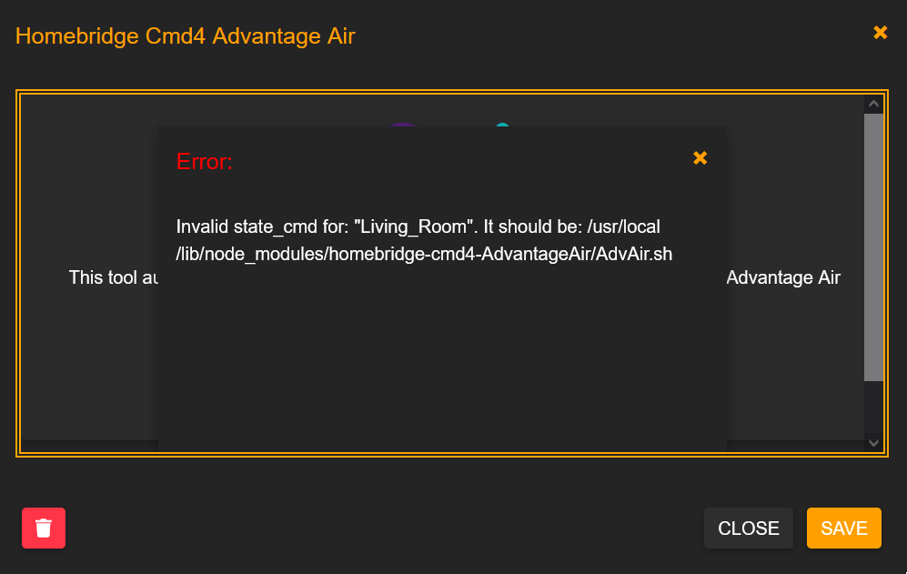

<p align="center">


</p>

<span align="center">
  
[](https://www.npmjs.com/package/homebridge-cmd4-advantageair)
[](https://www.npmjs.com/package/homebridge-cmd4-advantageair)
[](https://github.com/homebridge/homebridge/wiki/Verified-Plugins)
  
</span>

# homebridge-cmd4-AdvantageAir

Catered shell script to integrate air conditioner control units by Advantage Air into Homekit using the plug-in [homebridge-cmd4](https://github.com/ztalbot2000/homebridge-cmd4). 

No affiliation with Advantage Air.

## Supported Control Units:
* Air Conditioning:
  * [e-zone](https://apps.apple.com/au/app/e-zone/id925994857)
  * [MyAir](https://apps.apple.com/au/app/myair/id481563583)
  * [MyAir3](https://apps.apple.com/au/app/myair3/id645762642)
  * [MyAir4](https://apps.apple.com/au/app/myair4/id925994861)
  * [MyPlace](https://apps.apple.com/au/app/myplace/id996398299)
  * [zone10e](https://apps.apple.com/au/app/zone10e/id1076850364)

<I><B> Note: </B> [zone10](https://apps.apple.com/au/app/zone10/id510581478) does not appear to work with this plug-in. </I>

* Extras:
  * [MyPlace](https://apps.apple.com/au/app/myplace/id996398299)
     - [x] Lights 
     - [x] Garage Door
     - [ ] Motion Sensors
     - [ ] Relay Kit (Blinds, Gates, etc.)

<I><B> Note: </B> Config for these extras can be found [here](https://github.com/mitch7391/homebridge-cmd4-AdvantageAir/wiki/Config-Creation#myplace-extras). </I>


## How It Looks:
### Thermostat Mode (with Fan Speed) and Fan Mode:
<p align="left">


</p>

### Zone Control and Temperature Sensors:
<p align="left">


</p>

### Zone Control without Temperature Sensors: 
<p align="left">


</p>


## Installation:
### Raspbian/HOOBS/macOS/NAS:
1. Install Homebridge via these instructions for [Raspbian/HOOBS](https://github.com/homebridge/homebridge/wiki/Install-Homebridge-on-Raspbian) or [macOS](https://github.com/homebridge/homebridge/wiki/Install-Homebridge-on-macOS).
2. Install the [homebridge-cmd4](https://github.com/ztalbot2000/homebridge-cmd4) plug-in via the Homebridge UI ['plugins'](https://github.com/oznu/homebridge-config-ui-x#plugin-screen) tab search function.


3. Install `homebridge-cmd4-AdvantageAir` plug-in via the Homebridge UI 'plugins' tab search function.


4. Install <B>jq</B> via your Homebridge UI terminal or through ssh: 
```shell
# Raspbian/Hoobs:
sudo apt-get install jq

# macOS:
brew install jq

# Synology/QNAP NAS
apk add jq
```
5. Check if <B>curl</B> is installed (it should already be):
```
curl -V
```
6. If <B>curl</B> does not return a version number, install via:
```shell
# Raspbian/Hoobs:
sudo apt-get install curl

# macOS:
brew install curl

# Synology/QNAP NAS
apk add curl
``` 
7. Edit your homebridge `config.json` by modifying the samples included in the directory [Config_Samples](https://github.com/mitch7391/homebridge-cmd4-AdvantageAir/tree/master/Config_Samples) or by reading through and following the [Wiki](https://github.com/mitch7391/homebridge-cmd4-AdvantageAir/wiki/Config-Creation) guide to create your own config. This should all be edited from the Homebridge UI ['config'](https://github.com/oznu/homebridge-config-ui-x#configuration-screen) tab. <I><B>NOTE:</I></B> Two accessories cannot have the exact same `displayName` in your config. E.g. A switch and temperature sensor cannot both be named 'Kitchen'.
8. Restart Homebridge. 
9. Go to the 'plugins' tab in Homebridge UI and locate your newly installed `homebridge-cmd4-AdvantageAir`. Click `SETTINGS` and it should launch the 'Advantage Air Configuration Check'.


10. Click `CHECK CONFIGURATION`. It will check over your installation and config to make sure you have everything correct. On a success it will say `Passed`; if something is incorrect, an error message will pop up telling you what it is that you have missed and need to fix.

<p align="center">
  
</p>




### Windows OS
I have not successfully set this up on a Windows OS Homebridge server yet. If you have and want to contribute; please reach out and let me know how you did it. Otherwise I strongly suggest you buy a dedicated Raspberry Pi for Homebridge.


## Further Notes
You can read more about this project and how to create your config on the [Wiki](https://github.com/mitch7391/homebridge-cmd4-AdvantageAir/wiki) page.

## How to Keep Up-To-Date:
In version 3.0.0 and up, this repo is able to be added like a regular plug-in through Homebridge UI even though it is not a typical 'full' plug-in! By adding it through Homebridge UI, you no longer have to manually update the scripts yourself and they will be rolled out to you in updates via Homebridge UI. Feel free to give me a `Star` as well if you are happy with the work as it is nice to know how many people use this project!


## How You Can Help:
* Open Issues/Tickets.
* Report Bugs/Errors.
* Suggest Improvements and Features you would like to see!
* Help test the beta releases! See the [Wiki](https://github.com/mitch7391/homebridge-cmd4-AdvantageAir/wiki#beta-testing) to find out how to 'sign up'.  
* Create a fork, add or fix something yourself and create a Pull Request to be merged back into this repo!
* Let me know if you have a Control Unit or App that works that is not confirmed in my [Supported List](https://github.com/mitch7391/cmd4-AdvantageAir#supported-control-units)!
* Let me know if you can figure out how to get this running on Windows 10/11 Homebridge.
* Feel free to let me know you are loving the set up!


## Special Thanks:
1. The evolution, improvements and continuously tireless work of [John Talbot](https://github.com/ztalbot2000), who has not only improved these shell scripts beyond measure and created the Homebridge UI integration; but continues to improve [homebridge-cmd4](https://github.com/ztalbot2000/homebridge-cmd4) to further cater to this work and my end users.
2. The hard work and valued coding experince of [Ung Sing Wong](https://github.com/uswong) that has led to the many amazing features in a short space of time; and no doubt more to come in the future!
3. This would never have kicked off without the patience and kindness of [TimofeyK](https://github.com/TimofeyK) helping out a new starter find his feet.
4. Lastly, but certainly not least, is my beautiful Wife who has put up with what has become an obsession of mine to get our air conditioner and many other devices into Homekit. May she forever be misunderstood by Siri for my amusement...


## LICENSE:
This plugin is distributed under the MIT license. See [LICENSE](https://github.com/mitch7391/cmd4-E-Zone-MyAir/blob/master/LICENSE) for details.
